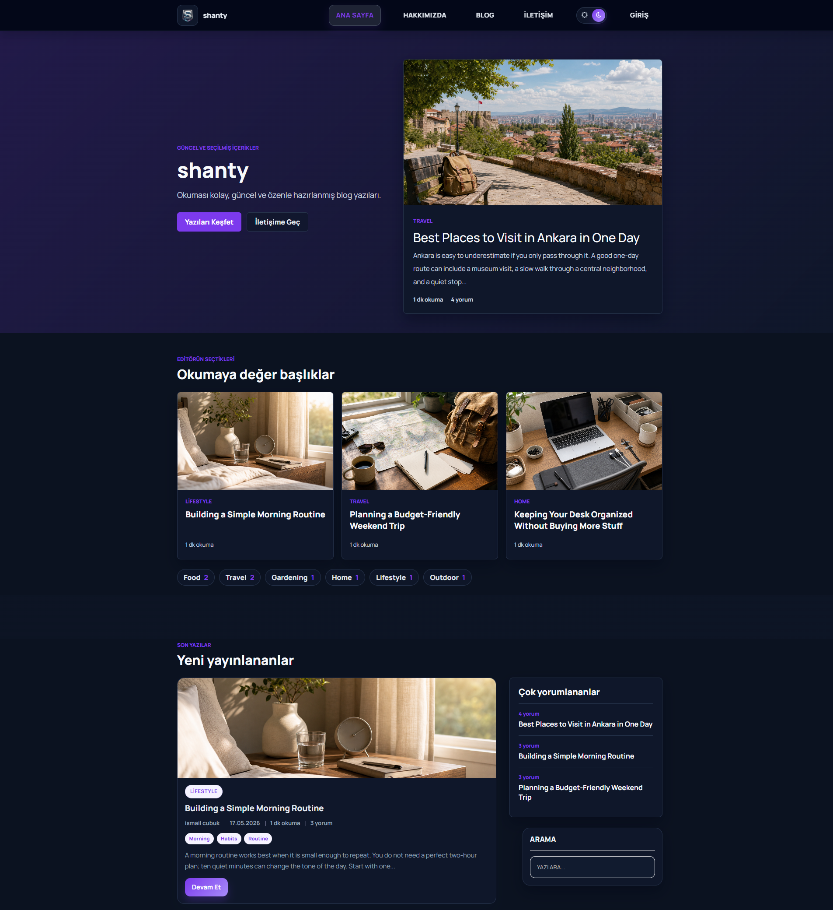

# Laravel Blog CMS

Responsive blog and content management system built with Laravel. Users can browse posts, filter content by category or tag, write comments, manage their profile, and create their own posts. Admin users can manage posts, categories, users, roles, comments, contact messages, pages, mail settings, and site branding from a dedicated dashboard.


Live demo: [Laravel Blog](https://ismail.lovestoblog.com/)



## Features

- Public blog homepage and post detail pages
- Category, tag, and author archive pages
- User registration, login, password reset, and email change verification
- User profile management with avatar upload, bio, phone, and social links
- User post workflow with create, draft, publish, and edit screens
- Comment system with threaded replies and admin replies
- Comment moderation with approved, pending, and spam states
- Contact form with throttling and admin reply workflow
- Admin dashboard with recent posts, users, comments, and activity views
- Admin post management with SEO fields, featured posts, image upload, and tags
- Category management
- User, role, and permission management
- Editable About, Contact, and Terms pages
- General, social, and mail settings
- Light/dark interface mode preference
- Responsive frontend and admin layouts
- Seeded demo content, authors, comments, and unique profile avatars

## Tech Stack

- PHP 8.2+
- Laravel 12
- MySQL
- Blade templates
- Vite
- JavaScript
- CSS
- Bootstrap / AdminLTE assets
- PHPUnit
- Laravel Mail / log mail workflow

## Project Structure

```text
app/
  Http/
    Controllers/
      Admin/
      Frontend/
    Middleware/
  Mail/
  Models/
  Services/
    Admin/
    Mail/
    Uploads/
  Support/

database/
  factories/
  migrations/
  seeders/

resources/
  css/
  js/
  views/
    admin/
    emails/
    layouts/
    pages/
    partials/

routes/
  admin.php
  frontend.php
  web.php

public/
  assets/
    css/
    images/
    js/
  adminlte/
  uploads/

tests/
  Feature/
  Unit/
```

## Demo Admin

If the local database has been seeded or updated with the demo admin account, you can sign in with:

```text
Email: admin@admin.com
Password: admin
```

## Main Routes

- `/` - Homepage
- `/blog` - Blog listing
- `/post/{slug}` - Post detail
- `/blog/kategori/{category}` - Category archive
- `/blog/etiket/{tag}` - Tag archive
- `/yazar/{user}` - Author page
- `/profile` - User profile settings
- `/blog/create` - Create user post
- `/blog/my-posts` - User posts
- `/contact` - Contact page
- `/admin/dashboard` - Admin dashboard
- `/admin/posts` - Admin post management
- `/admin/comments` - Comment moderation
- `/admin/contact-messages` - Contact message inbox
- `/admin/users` - User management
- `/admin/settings/general` - Site settings
